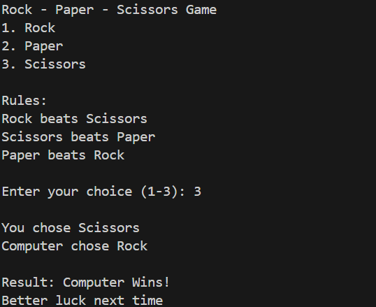

# ROCK-PAPER-SCISSORS-GAME
The Rock–Paper–Scissors game is a simple and popular hand game usually played between two 
players. In this game, each player chooses one of the three options: Rock, Paper, or Scissors. The 
rules are simple: Rock beats Scissors, Scissors beats Paper, and Paper beats Rock. The game is 
often used to demonstrate basic decision-making and logical conditions. 
 
In this project, the Rock–Paper–Scissors game is implemented using the C programming 
language. The program allows the user to select an option, while the computer automatically 
generates its choice using random numbers. Based on both choices, the program compares the 
results and declares the winner or a draw. 
 
This project helps in understanding important programming concepts such as conditional 
statements, random number generation, input/output operations, and control structures in 
C. The game is interactive, easy to use, and demonstrates how simple logic can be applied to create 
a real-world application using C programming.

